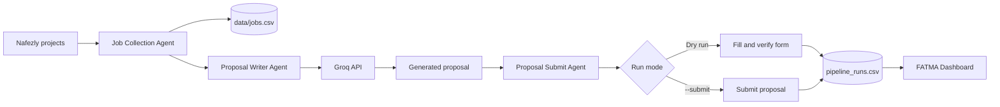

# FATMA

### Freelance Application Task Multi-Agent


FATMA is a Python multi-agent system that monitors freelance projects on
[Nafezly](https://nafezly.com/), creates tailored proposals with an AI model,
and fills or submits applications through a shared browser session.

The system is designed to keep the risky action explicit: proposal submission
is disabled by default, so FATMA can collect jobs, generate proposals, and fill
forms without clicking the final submit button.

## What FATMA does

- Monitors recent development projects across configurable listing pages.
- Saves new, open jobs to a CSV file without duplicating existing entries.
- Extracts the title and description from each project.
- Uses Groq to generate a proposal, delivery period, and offer price.
- Saves every generated proposal as a text file.
- Fills the Nafezly offer form and verifies its values.
- Submits only when real-submit mode is explicitly enabled.
- Records pipeline results, errors, and submission state.
- Provides a local dashboard for running and monitoring the agents.

## Agents

| Component | Responsibility |
| --- | --- |
| Job Collection Agent | Signs in, scans recent Nafezly projects, filters open development jobs, and stores them in CSV. |
| Proposal Writer Agent | Reads a project page and asks the configured Groq model for a focused proposal and offer values. |
| Proposal Submit Agent | Fills and verifies the offer form, then optionally submits it. |
| Pipeline Runner | Coordinates all agents in one authenticated Chrome session and tracks processed jobs. |
| Dashboard | Starts individual tasks or the full pipeline and displays jobs, runs, logs, configuration, and agent state. |

## How it works



The full pipeline signs in once and shares the same Selenium-controlled Chrome
session between the agents. Jobs marked `success` or `skipped` are treated as
handled and are not processed again unless `--reprocess` is used.

## Requirements

- Python 3.10 or newer
- Google Chrome
- A Nafezly account
- A Groq API key
- Internet access for Nafezly, Groq, and ChromeDriver setup

Python packages:

- `beautifulsoup4`
- `selenium`
- `webdriver-manager`

## Installation

Clone the project, open a terminal in its root directory, and create a virtual
environment:

```powershell
python -m venv .venv
.\.venv\Scripts\Activate.ps1
python -m pip install --upgrade pip
pip install -r requirements.txt
```

On macOS or Linux, activate the environment with:

```bash
source .venv/bin/activate
```

## Configuration

FATMA reads settings from environment variables first, then
`system_config.json`, and finally the defaults in `config.py`.

Set secrets as environment variables instead of committing them:

```powershell
$env:NAFEZLY_USERNAME = "you@example.com"
$env:NAFEZLY_PASSWORD = "your_password"
$env:GROQ_API_KEY = "your_groq_api_key"
$env:FATMA_DASHBOARD_USERNAME = "admin"
$env:FATMA_DASHBOARD_PASSWORD = "a_strong_password"
```

Common settings:

| Variable | Purpose | Default behavior |
| --- | --- | --- |
| `NAFEZLY_USERNAME` | Nafezly login email | Required for account login |
| `NAFEZLY_PASSWORD` | Nafezly password | Required for account login |
| `GROQ_API_KEY` | Groq authentication | Required to generate proposals |
| `GROQ_PROPOSAL_MODEL` | Proposal-generation model | `llama-3.3-70b-versatile` |
| `JOBS_CSV_PATH` | Collected-jobs output | `data/jobs.csv` |
| `RECENT_JOB_MAX_AGE_MINUTES` | Maximum age of jobs to process | `5` |
| `JOB_POLL_INTERVAL_MINUTES` | Delay between monitoring cycles | `15` |
| `JOB_LIST_PAGES_PER_CYCLE` | Listing pages checked per cycle | `5` |
| `GROQ_CALL_INTERVAL_SECONDS` | Minimum delay between model calls | `2` |
| `DEFAULT_PROPOSAL_PERIOD_DAYS` | Fallback delivery period | `3` |
| `DEFAULT_PROPOSAL_COST_USD` | Fallback offer cost | `25` |
| `CHROME_USER_DATA` | Chrome user-data directory | Configured locally |
| `CHROME_PROFILE` | Chrome profile name | Configured locally |

You can also edit these values from the dashboard's **Configs** page.

> [!IMPORTANT]
> Review `config.py` before publishing or deploying this repository. Keep
> account passwords, API keys, and dashboard credentials out of source control,
> rotate any credentials that have already been committed, and use environment
> variables or a secret manager.

## Running FATMA

### Safe one-cycle dry run

This collects jobs, writes proposals, and fills forms without submitting them:

```powershell
python run.py --once
```

### Submit proposals

Real submission requires the explicit `--submit` flag:

```powershell
python run.py --once --submit
```

Use this carefully. FATMA will act on the configured Nafezly account.

### Continuous monitoring

```powershell
python run.py
```

Stop the process with `Ctrl+C`.

### Useful options

```text
--submit                    Click the final proposal submit button
--once                      Run one monitoring cycle and stop
--max-jobs N                Stop after N jobs; 0 means unlimited
--pages N                   Scan N project-list pages per cycle
--max-age-minutes N         Process jobs newer than N minutes
--poll-interval-minutes N   Wait N minutes between cycles
--reprocess                 Include previously handled jobs
--keep-browser-open         Leave Chrome open when the run finishes
```

Example:

```powershell
python run.py --once --max-jobs 3 --pages 2
```

## Dashboard

Start the local dashboard:

```powershell
python dashboard.py
```

Then open [http://127.0.0.1:8765](http://127.0.0.1:8765).

The dashboard includes:

- Pipeline and agent controls
- Dry-run and real-submit modes
- Live status and system logs
- Collected jobs and pipeline history
- Generated proposal files
- Editable runtime configuration
- Persistent task history in SQLite

The dashboard login is configured with `FATMA_DASHBOARD_USERNAME` and
`FATMA_DASHBOARD_PASSWORD`. Set both before using FATMA outside a trusted local
machine.

## Run an individual agent

Collect jobs only:

```powershell
python "job collection agent\scrape_projects_to_csv.py"
```

Write a proposal for one project:

```powershell
python "proposal writer agent\write_proposal.py" "https://nafezly.com/project/PROJECT"
```

Write and fill the proposal form:

```powershell
python "proposal submit agent\write_and_submit_proposal.py" "https://nafezly.com/project/PROJECT"
```

Write and submit:

```powershell
python "proposal submit agent\write_and_submit_proposal.py" "https://nafezly.com/project/PROJECT" --submit
```

## Project structure

```text
.
├── assets/
│   ├── fatma-hero.png
│   └── fatma-system-overview.png
├── data/
│   └── jobs.csv
├── job collection agent/
├── proposal writer agent/
│   └── generated proposals/
├── proposal submit agent/
├── system/
│   ├── design.py
│   ├── pages.py
│   ├── state_store.py
│   └── system_state.db
├── tests/
├── config.py
├── dashboard.py
├── pipeline_runs.csv
├── requirements.txt
├── run.py
├── system_config.json
└── system.log
```

## Output and state

| Path | Contents |
| --- | --- |
| `data/jobs.csv` | Collected project records |
| `proposal writer agent/generated proposals/` | Generated proposal text files |
| `pipeline_runs.csv` | Job-level pipeline results and errors |
| `system.log` | Dashboard and task output |
| `system/system_state.db` | Persistent dashboard task history |
| `system_config.json` | Dashboard-managed configuration overrides |

## Tests

Run the unit tests from the project root:

```powershell
python -m unittest discover -s tests -v
```

The submission-form test launches Chrome, so Chrome and ChromeDriver access
must be available.

## Safety and responsible use

- Start with dry-run mode and inspect generated proposals.
- Confirm the proposed price, delivery period, and wording before submission.
- Respect Nafezly's terms, rate limits, and platform policies.
- Do not use FATMA for spam or indiscriminate applications.
- Keep personal data, browser profiles, passwords, and API keys private.
- Website markup can change; verify selectors before unattended operation.

## Current scope

FATMA currently targets Nafezly and its present page structure. It is a local
automation project, not a hosted service. Support for other freelance platforms
would require new collectors, login flows, page selectors, and submitters.
